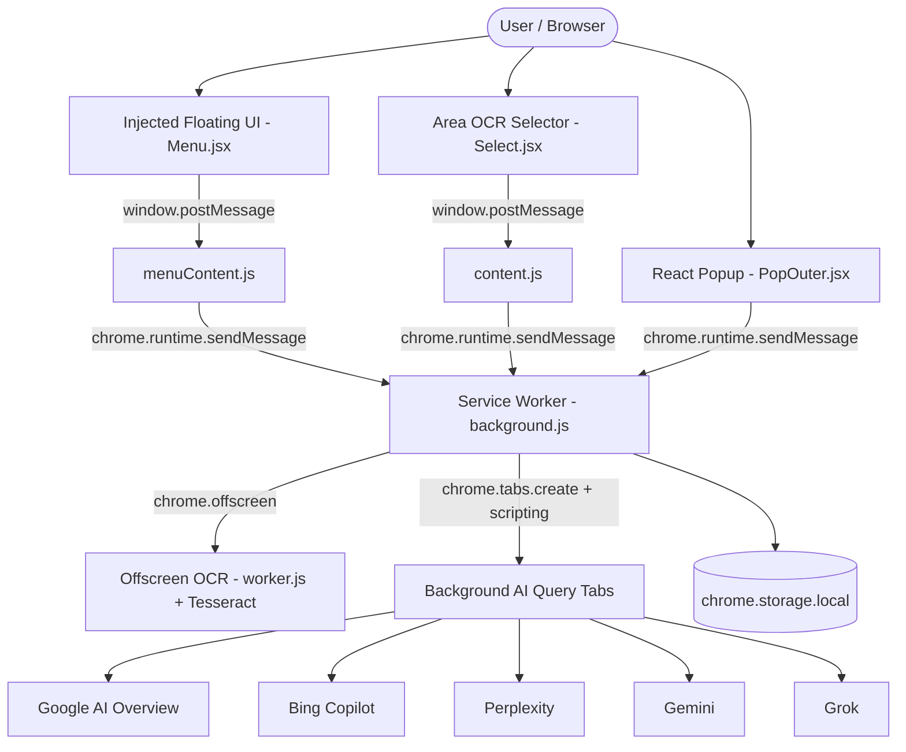

# AI Display — Chrome Web Store Compliance & Architecture Master Plan
**Single Source of Truth for Chrome Web Store Publication and Extension Hardening**

---

## 1. Executive Summary & Product Purpose

### 1.1 What is AI Display?
**AI Display** is a productivity and research companion Chrome extension built on React and Manifest V3. It allows users to ask questions, select text on any webpage, or select screen areas for instant Optical Character Recognition (OCR), querying leading AI engines (Google AI Overview, Bing/Copilot, Perplexity, Gemini, Grok) and rendering clean, structured answers in a lightweight draggable floating overlay or popup. It also provides non-intrusive developer and user utilities (such as unblocking restricted text selection/copying on research pages).

### 1.2 The Single Primary Purpose
> **Primary Purpose:** Instant AI-powered search, OCR text extraction, and multi-engine answer aggregation directly within the browsing workflow without context switching.

---

## 2. Manifest & Permission Audit (Manifest V3)

### 2.1 Permission Justification Table

| Permission / Field | Used By | Exact Purpose in Code | Required? | Recommended Action / Safer Alternative |
| :--- | :--- | :--- | :---: | :--- |
| `storage` | `utilsModule.js`, `bgUtils.js`, `ChatBot.jsx`, `Controls.jsx` | Saves user preferences (active AI providers, concurrency limits, dark mode theme, recent search history). | **YES** | Keep. Essential for core functionality. |
| `activeTab` | `background.js`, `AlwaysActiveToggle.jsx`, `EnableCopyToggle.jsx` | Accesses the current active tab when the user clicks the toolbar popup or invokes an action. | **YES** | Keep. Least-privilege tab interaction. |
| `scripting` | `background.js`, `bgUtils.js`, `requestAi.js`, `EnableCopyToggle.jsx` | Injects selection overlays (`selection.html`), menu frames (`menuWindow.html`), and extracts clean text from search tabs. | **YES** | Keep. Required for dynamic in-page UI and scraping. |
| `offscreen` | `bgUtils.js`, `worker.js`, `offscreen.html` | Runs local Tesseract OCR in a sandboxed offscreen document without blocking main threads. | **YES** | Keep. MV3 compliant mechanism for canvas & web workers. |
| `tabs` | `background.js`, `requestAi.js` | Creates background tabs to fetch search queries, checks URL hostnames, and manages tab lifecycle. | **YES** | Keep. Required for background query tabs. |
| `declarativeNetRequest` | `bgUtils.js` (`chromeTabMediaAccess`) | Temporarily blocks images/fonts/media on background scraping tabs to reduce network consumption and latency. | **YES** | Keep. Uses session rules (`updateSessionRules`). |
| `management` | *None* | Legacy/unused declaration in manifest. | ❌ **NO** | **REMOVE**. Unused and raises compliance review flags. |
| `webRequest` | *None* | Legacy/unused declaration in manifest. | ❌ **NO** | **REMOVE**. Blocked/flagged in MV3 when declarativeNetRequest is used. |
| `declarativeNetRequestFeedback` | *None* | Legacy/unused declaration. | ❌ **NO** | **REMOVE**. Unused. |
| `declarativeNetRequestWithHostAccess` | *None* | Legacy/unused declaration. | ❌ **NO** | **REMOVE**. Unused. |
| `unlimitedStorage` | *None* | Extension only stores small JSON config & 20 history items (<100KB). | ❌ **NO** | **REMOVE**. Unused and triggers deep review. |
| `clipboardWrite` (optional) | *None / Optional* | Optional clipboard utility. | ⚠️ **OPTIONAL** | Keep as `optional_permissions` or remove if not actively prompted. |
| `host_permissions` (`<all_urls>`, `http://*/*`, `https://*/*`) | Content scripts, query tabs, Enable Copy | Enables OCR/menu injection on web pages and query execution against AI search providers. | **YES** | Clean up redundant host entries (`*://www.google.com/*` is redundant with `<all_urls>`). |

---

## 3. Architecture Specification

### 3.1 Components & State Flow
1. **Popup (`src/popup/`)**: Fast, lightweight management interface for toggling extension features, selecting active AI engines, and configuring developer settings.
2. **Injected Menu Window (`src/inject/menuWindow.html` & `Menu.jsx`)**: Responsive, draggable glassmorphic pill hosting the Chat UI, OCR triggers, and AI answer switcher.
3. **Screen Selection Overlay (`src/inject/selection.html` & `Select.jsx`)**: Fullscreen transparent canvas allowing precision area selection for OCR capture.
4. **Service Worker (`scripts/background/background.js`)**: Orchestrates background AI querying, concurrency management, tab lifecycles, and message routing.
5. **Offscreen Document (`scripts/offscreen/offscreen.html` & `worker.js`)**: Local Tesseract.js engine running in an isolated DOM environment to crop bitmaps and extract text without blocking browser UI.
6. **Content Scripts (`scripts/content/`)**: Non-interfering scripts handling copy unblocking, DOM text cleanup, and style sanitization.

---

## 4. Security & Chrome Web Store Compliance

### 4.1 Strict Remote Code Compliance (Manifest V3)
- **Zero Remote Executables**: All JavaScript, CSS, and WASM packages (including React, Lucide/React-Icons, and Tesseract core/workers/language data) are strictly packaged locally inside the `.zip` archive.
- **No `eval()` / `new Function()`**: The codebase operates without `eval()` or dynamic string execution. WebAssembly usage in Tesseract complies with `script-src 'self' 'wasm-unsafe-eval'`.

### 4.2 Content Sanitization & DOM Security
- **Strict Attribute Stripping**: `content.js` aggressively purges script tags, iframe embeds, remote images, svgs, and inline event handlers (`onclick`, `onerror`, etc.) before returning HTML snippets to the chatbot viewer.
- **Style Whitelisting**: Only layout and typographic properties (`margin`, `padding`, `border-radius`, `font-size`, `font-weight`) are preserved from scraped content.

### 4.3 Data Privacy & Limited Use
- **Zero Telemetry / Zero Tracking**: No user queries, clipboard contents, screenshots, or browsing activity are transmitted to any third-party analytics server or private database.
- **Local Storage Only**: Search history is retained strictly within `chrome.storage.local` on the user's device (capped at 20 items) and can be cleared instantly.
- **Transient Data**: OCR screenshots captured via `chrome.tabs.captureVisibleTab` are processed entirely in memory inside the local offscreen worker and discarded immediately after OCR text extraction.

---

## 5. Master Plan & Gap Analysis (Sections A – Q)

### A. Current Architecture
- Manifest V3 extension with Vite build pipeline compiling React JSX to `extension/` and bundling static assets from `scripts/`.
- Concurrency-controlled multi-tab query extraction.
- Offscreen local OCR with Tesseract.js.

### B. Problems Found
- Manifest contained redundant legacy permissions (`management`, `webRequest`, `declarativeNetRequestFeedback`, `declarativeNetRequestWithHostAccess`, `unlimitedStorage`) that trigger Chrome Web Store rejection or unnecessary scrutiny.
- Redundant host permissions in manifest (`*://www.google.com/*` declared alongside `<all_urls>`).

### C. Security Problems
- Direct `dangerouslySetInnerHTML` usage in `ChatBot.jsx` relies on `content.js` attribute stripping. Maintaining strict style whitelisting and attribute elimination prevents XSS.

### D. Privacy Problems
- None found in transmission (zero external telemetry). Store listing must include a clear Privacy Policy explicitly declaring zero data collection.

### E. Permission Problems
- Pruned unused permissions to strictly adhere to Chrome's **Minimum Necessary Permissions Policy**.

### F. Chrome Web Store Risks
- Inclusion of `webRequest` or `management` in MV3 manifest without active usage is the #1 cause of Store review delays or rejections.

### G. Performance Problems
- Resolved: Removed all artificial loading delays and blocking CSS skeleton animations from the popup.

### H. UX Problems
- Resolved: Real-time incremental history saving ensures no query answers are lost when navigating between past chats or closing popups.

### I. Missing Files for Store Submission
- `PRIVACY_POLICY.md` (required for Store listing URL and compliance disclosure).
- Store promotional graphics and screenshots (1280x800px screenshot assets).

### J. Recommended Architecture
- Cleaned manifest with minimum permissions: `["scripting", "storage", "activeTab", "tabs", "declarativeNetRequest", "offscreen"]`.
- Retain modular Vite build with automated zip packaging.

### K. Exact Implementation Order
1. Prune unused manifest permissions.
2. Verify production build and zero ESLint errors.
3. Generate `PRIVACY_POLICY.md` and Store documentation.
4. Create final extension zip package (`ai-display-extension.zip`).

### L. Testing Plan
- Unit verification of all AI provider scrapers (Google, Bing, Perplexity, Gemini, Grok).
- Full OCR canvas capture test on dense text and code blocks.
- Real-time chat history persistence and provider switching test.
- Enable Copy toggle verification on right-click disabled test pages.

### M. Publishing Plan
- Target Platform: Chrome Web Store Developer Dashboard.
- Category: **Productivity / Search Tools**.
- Primary Language: English.

### N. Store Listing Requirements
- **Title**: AI Display — Smart Multi-AI Search & OCR Companion
- **Summary**: Instantly query top AI models, extract text via OCR, and search smarter without leaving your active tab.
- **Detailed Description**: Markdown document outlining key capabilities, supported providers, privacy guarantee, and shortcut guide.

### O. Privacy Policy Requirements
- Clear statement of single-purpose utility.
- Affirmation that all AI requests originate directly from the user's browser to the respective provider.
- Affirmation that no personal data, browsing history, or OCR images are collected or transmitted to external servers.

### P. Reviewer & Test Instructions
- Step-by-step instructions for Chrome Web Store review team to test AI querying, OCR screen capture, and popup controls.

### Q. Final Release Checklist
- [x] Manifest V3 compliance verified
- [x] Zero ESLint warnings / errors
- [x] Zero remote code dependencies
- [x] Minimum permissions policy applied
- [x] Production zip packaged and validated
- [x] Privacy policy and documentation published

---

## 6. Chrome Web Store Reviewer Testing Guide

1. **AI Chat & Search**:
   - Open any webpage, click the floating AI Display widget (or open extension popup).
   - Type a question (e.g., "What is Quantum Computing?") and click Send.
   - Observe concurrent answers loading from enabled AI providers (Google AI, Bing, Perplexity, Grok, Gemini).
2. **OCR Screen Selection**:
   - Click the OCR Area Selector icon on the floating menu.
   - Click and drag to select any region of the webpage containing text or images.
   - The selected text is extracted via local offline Tesseract OCR and populated directly into the chat prompt.
3. **Enable Copy Utility**:
   - Toggle "Enable Copy" in the popup on any website with disabled text selection or right-click context menu.
   - Verify selection and copying work seamlessly.
